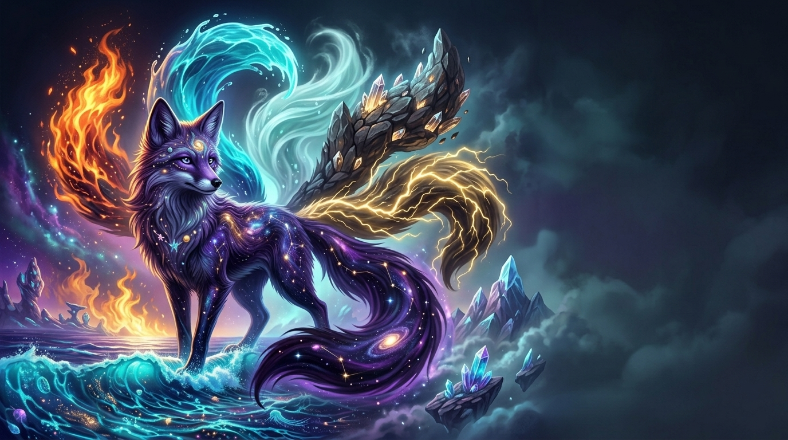
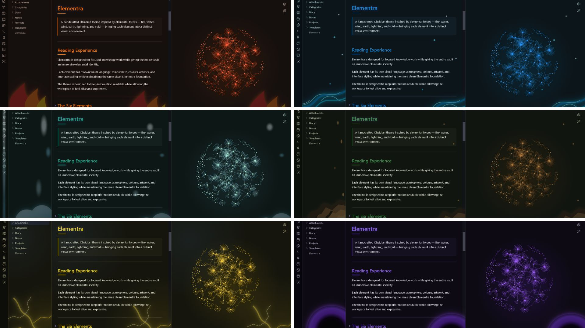
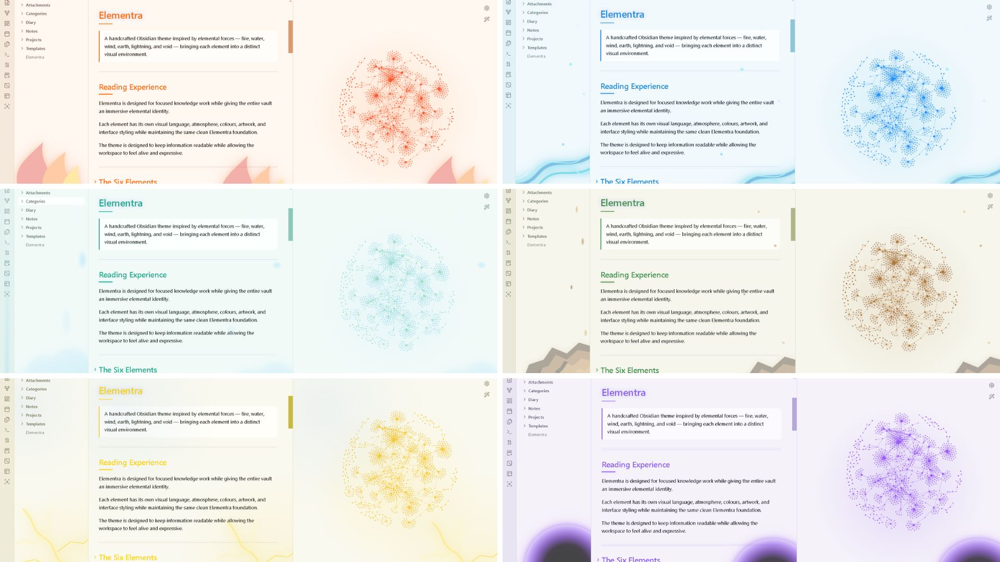
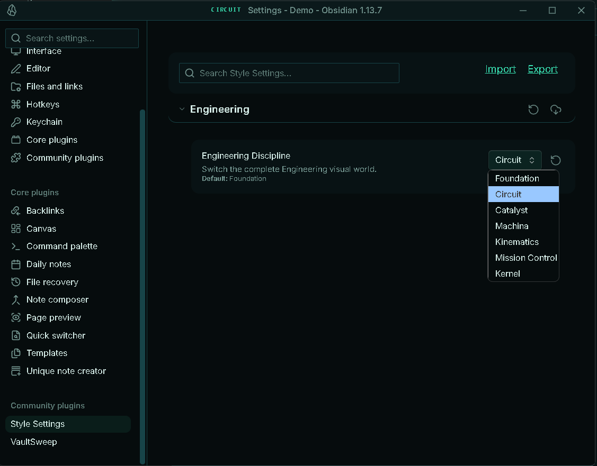

# Elementra


**A visual Obsidian theme built around elemental worlds — each with its own colour, atmosphere, visual language, and design system.**

Elementra transforms your vault into an elemental environment where notes, links, properties, tables, code, and graphs become part of a living visual system.

Designed for **students, researchers, developers, writers, designers, creators, knowledge workers, planners, and anyone who wants their Obsidian vault to feel more immersive and personal.**

---

## Preview



> **One vault. Six elements. A workspace shaped by the power of the elements.**

---

# The Six Elements

Elementra contains six distinct elemental worlds.

They are **not simply colour presets**. Each element has its own visual atmosphere and artwork designed around its elemental identity.

| Element | Colour | Elemental Character |
|---|---|---|
| 🔥 **Fire** | Ember Orange | Energy, heat, movement, intensity |
| 💧 **Water** | Cyan Blue | Flow, waves, fluidity, calm |
| 🌪️ **Wind** | Sky Blue | Air, clouds, movement, freedom |
| 🪨 **Earth** | Stone Brown | Rock, structure, stability, nature |
| ⚡ **Lightning** | Electric Yellow | Electricity, energy, speed, power |
| 🕳️ **Void** | Violet / Black | Gravity, space, darkness, mystery |

Each element shares the same Elementra foundation while creating a completely different visual environment.

---

# Screenshots

## Elementra — Dark Mode



A dark elemental environment showcasing the Elementra visual system.

## Elementra — Light Mode



A clean light environment designed around the elemental system.

---

# Features

| Feature | Description |
|---|---|
| 🔥 **Fire Element** | Flowing flames, ember glow, and energetic visual effects |
| 💧 **Water Element** | Large flowing waves, droplets, and aquatic atmosphere |
| 🌪️ **Wind Element** | Cloud-like forms, air movement, and atmospheric shapes |
| 🪨 **Earth Element** | Rock, stone, geological forms, and natural textures |
| ⚡ **Lightning Element** | Branching lightning, electric glow, and energy effects |
| 🕳️ **Void Element** | Spinning black-hole inspired orb, vortex, and cosmic atmosphere |
| 🎨 **Elemental Systems** | Each element has its own visual environment |
| 🌑 **Dark Mode** | Immersive elemental dark workspace |
| ☀️ **Light Mode** | Dedicated light-mode environment |
| 🔗 **Graph View** | Elemental graph styling and visual atmosphere |
| 📊 **Tables** | Structured and readable data presentation |
| 💻 **Code Blocks** | Technical and programming surfaces |
| 🗂️ **Properties** | Clean metadata and property presentation |
| 🏷️ **Tags** | Compact visual classification |
| ☑️ **Tasks** | Clear task and project states |
| 📐 **Canvas** | Visual workspace for diagrams and planning |
| 📱 **Mobile** | Responsive mobile interface |

---

# Elementra Is More Than a Colour Theme

The six elements are not six simple colour schemes.

Each element represents a different visual world.

Changing the element can affect:

- Interface colours
- Background and panel surfaces
- Typography
- Borders and separators
- Buttons and interactive elements
- Tables and data presentation
- Code surfaces
- Properties
- Navigation
- Graph View
- Elemental artwork
- Background atmosphere
- Visual hierarchy

> **Choose the element that matches your mood, workflow, or imagination.**

---

# The Six Elemental Worlds

| Element | Colour | Character |
|---|---|---|
| 🔥 **Fire** | Ember Orange | Energy, heat, movement |
| 💧 **Water** | Cyan Blue | Flow, waves, calm |
| 🌪️ **Wind** | Sky Blue | Air, clouds, freedom |
| 🪨 **Earth** | Stone Brown | Rock, stability, structure |
| ⚡ **Lightning** | Electric Yellow | Speed, electricity, power |
| 🕳️ **Void** | Violet / Black | Space, gravity, mystery |

> **Six elements. One Elementra system.**

---

# Changing the Element

Elementra uses the **Style Settings** community plugin to control its elemental system.

The Style Settings plugin is required to switch between the six Elementra elements or customize the theme.

## Install Style Settings

1. Open **Obsidian**.
2. Open **Settings**.
3. Select **Community plugins**.
4. Click **Browse**.
5. Search for **Style Settings**.
6. Select **Style Settings**.
7. Click **Install**.
8. Click **Enable**.

> **Style Settings is a separate Obsidian community plugin. It is not included with the Elementra theme.**

## Select an Element

1. Open **Settings**.
2. Go to **Style Settings**.
3. Find the **Elementra** section.
4. Locate **Elementra Element**.
5. Select your preferred element.

Elementra will apply the selected elemental environment.

> **Changing the element changes the overall Elementra atmosphere, not just its colour.**

Your notes, files, content, and vault structure remain unchanged.



---

# Built for Creative Thinkers

Elementra is suited for:

- 🎓 Students
- 🔬 Researchers
- 💻 Developers
- 🧑‍💻 Programmers
- ✍️ Writers
- 🎨 Designers
- 📚 Knowledge Managers
- 🧠 Researchers
- 📋 Project Planners
- 🗺️ Worldbuilders
- 🎮 Game Designers
- 🛠️ Makers
- 🌌 Creative Thinkers
- 📝 Note-taking enthusiasts
- ⚡ Anyone who wants a more immersive Obsidian workspace

Designed for anyone who enjoys **visual environments, elemental themes, creativity, organization, exploration, and immersive knowledge systems**.

---

# Design Philosophy

Elementra is built around a simple idea:

> **Your workspace should feel like a world.**

Different parts of the vault become part of an elemental environment.

- **Notes** become knowledge.
- **Folders** become territories.
- **Links** become connections.
- **Tags** become classifications.
- **Properties** become information.
- **Tasks** become actions.
- **Tables** become structured data.
- **Canvas** becomes a visual space.
- **Code** becomes the technical layer.
- **Graph View** becomes the elemental network.
- **Elements** become different worlds.

> **Structure meets atmosphere.**

---

# Elementra System

```text
                           ELEMENTRA
                               │
              ┌────────────────┼────────────────┐
              │                │                │
            FIRE             WATER             WIND
           Energy             Flow              Air
              │                │                │
              └────────────────┼────────────────┘
                               │
              ┌────────────────┼────────────────┐
              │                │                │
            EARTH          LIGHTNING            VOID
           Structure          Power             Space
              │                │                │
              └────────────────┼────────────────┘
                               │
                          ELEMENTRA
                       One visual system
```

Each element has its own identity while remaining part of the same Elementra design system.

---

# Elemental Visual Language

Elementra takes visual inspiration from:

- 🔥 Flames and combustion
- 💧 Waves and flowing water
- 🌪️ Clouds and atmospheric movement
- 🪨 Rocks and geological formations
- ⚡ Branching electrical discharges
- 🕳️ Black holes and cosmic vortices
- 🌌 Space and cosmic environments
- ✨ Energy and natural phenomena

The goal is **immersive elemental atmosphere without sacrificing usability**.

---

# Typography

- **Body:** IBM Plex Sans
- **Headings:** IBM Plex Sans
- **Technical:** IBM Plex Mono

Typography is designed to remain **clean, readable, modern, and compatible with the elemental visual system**.

---

# Installation

1. Download the Elementra theme.
2. Copy the theme folder to:

```text
YourVault/.obsidian/themes/
```

3. Open **Obsidian → Settings → Appearance**.
4. Select **Elementra**.
5. Install and enable **Style Settings** if you want to change the Elementra element.

---

# Compatibility

| Feature | Status |
|---|---|
| Desktop | ✅ |
| Mobile | ✅ |
| Dark Mode | ✅ |
| Light Mode | ✅ |
| Live Preview | ✅ |
| Properties | ✅ |
| Tables | ✅ |
| Code Blocks | ✅ |
| Dataview | ✅ |
| Tasks | ✅ |
| Canvas | ✅ |
| Excalidraw | ✅ |
| Graph View | ✅ |

---

# Screenshots

```text
screenshots/
├── dark.png
└── light.png
```

The Dark and Light screenshots showcase the Elementra visual system and its elemental environments.

---

# Support ☕

If you enjoy Elementra and want to support development:

<a href="https://www.buymeacoffee.com/CosmicSeaFox" target="_blank">

</a>

<a href="https://ko-fi.com/cosmicseafox" target="_blank">

</a>

---

# Credits

**Fonts**

- IBM Plex Sans
- IBM Plex Mono

**Visual Inspiration**

Elementra is inspired by natural and cosmic phenomena including fire, water, wind, earth, lightning, black holes, atmospheric formations, geological structures, electrical discharges, and cosmic environments.

Made for the Obsidian community.

---

# License

MIT License

**Elementra — Six elements. One world.**
