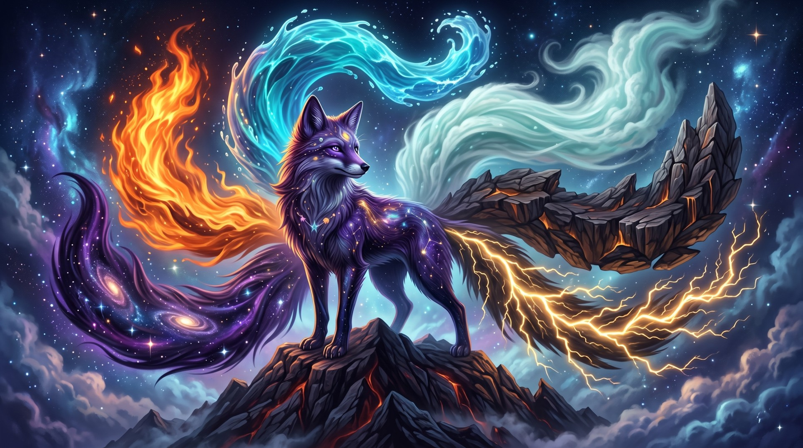
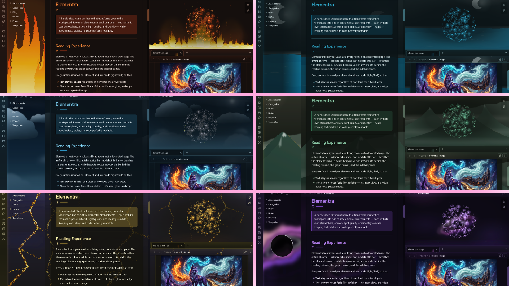
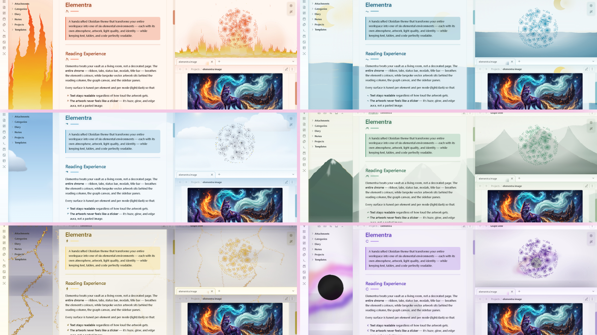
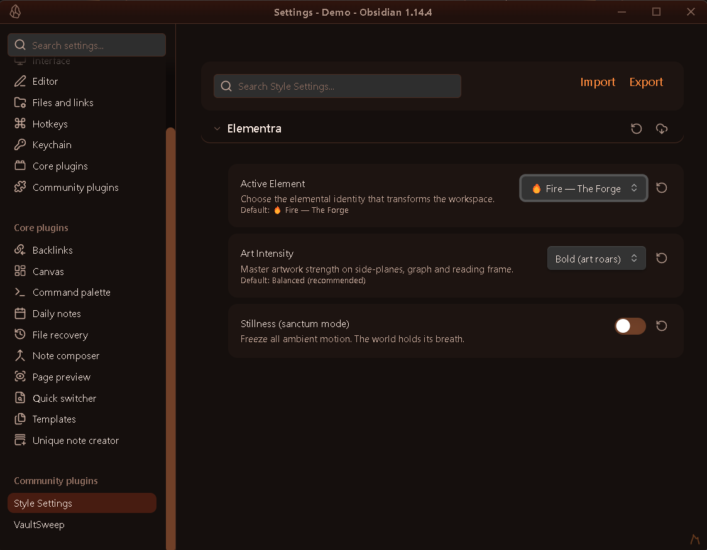

# Elementra


> **Your vault was never meant to feel ordinary.**

Elementra is an atmospheric Obsidian theme built around six elemental worlds.

Open your vault and you don't simply choose a colour.

You choose a world.

🔥 Fire brings heat and energy.  
💧 Water moves quietly through the interface.  
🌪️ Wind keeps everything in motion.  
🪨 Earth gives the workspace weight and structure.  
⚡ Lightning brings speed and intensity.  
🕳️ Void disappears into darkness and space.

Each element has its own colours, artwork, atmosphere, motion, and visual identity while remaining part of the same design system.

> **Six elements. One world. Your vault.**

---

# Preview



---

# What's New

The latest Elementra update expands the original theme into a more complete elemental system.

| Update | Description |
|---|---|
| **Living Atmosphere** | Subtle drift, rise, breathe, flicker, gust, and twinkle effects |
| **Elemental Sigils** | Each element now has its own visual symbol |
| **Elemental Motion** | Tabs and task completion react differently to each element |
| **Design Tokens** | New controls for ink, halo, core, ground, masks, and artwork |
| **Enhanced Tabs** | Elemental sigils, artwork, masking, and motion |
| **Enhanced Callouts** | Element-aware colours and subtle sigils |
| **Animated Tasks** | Individual completion effects for each element |
| **Refined Graph** | Updated elemental colours and atmospheric styling |
| **Better Tables** | Improved Live Preview and table-editor compatibility |
| **More Embeds** | Refined image, video, PDF, and file surfaces |
| **Accessibility** | Focus states, clarity controls, and Still Mode |
| **Dark & Light** | Dedicated elemental treatment for both modes |
| **Obsidian Coverage** | Improved styling for Canvas, metadata, menus, CM6, and embeds |

> **Same six elements. A deeper system.**

---

# The Six Elements

Elementra currently contains six distinct elemental environments.

They are not simple colour presets. Each one has its own visual language and atmosphere.

| Element | World | Character |
|---|---|---|
| 🔥 **Fire** | **The Ember** | Energy · Heat · Intensity |
| 💧 **Water** | **The Tide** | Flow · Memory · Calm |
| 🌪️ **Wind** | **The Sky** | Air · Freedom · Movement |
| 🪨 **Earth** | **The Range** | Structure · Nature · Stability |
| ⚡ **Lightning** | **The Storm** | Speed · Power · Focus |
| 🕳️ **Void** | **The Abyss** | Space · Gravity · Mystery |

---

# Screenshots

## Dark Mode



## Light Mode




---

# Elemental Atmosphere

The updated version introduces subtle motion to each environment.

| Element | Atmosphere |
|---|---|
| 🔥 **Fire** | Rising warmth and ember movement |
| 💧 **Water** | Slow flowing drift |
| 🌪️ **Wind** | Gusts, haze, and air movement |
| 🪨 **Earth** | Grounded vertical movement |
| ⚡ **Lightning** | Electric flicker |
| 🕳️ **Void** | Cosmic twinkle |

The motion is intentionally restrained so the interface remains practical for everyday work.

---

# Elemental Details

Elementra extends its visual system across the Obsidian interface.

| Surface | Treatment |
|---|---|
| Notes | Clean reading and writing surfaces |
| Links | Elemental accent colours |
| Tags | Compact visual classification |
| Tables | Structured presentation |
| Code | Technical colour system |
| Properties | Clean metadata surfaces |
| Tasks | Element-specific completion effects |
| Callouts | Element colour and sigil |
| Tabs | Sigil, artwork, masking, and atmosphere |
| Menus | Elemental selected states |
| Graph View | Elemental nodes and atmosphere |
| Images | Refined media surfaces |
| Video | Integrated media styling |
| PDF | Raised embedded surface |
| File Embeds | Elemental accent treatment |
| Canvas | Decoration-aware styling |

---

# Elemental Sigils

Each element has its own sigil.

The sigils are used selectively across the interface, including:

- Lists
- Callouts
- Active tabs
- Menus
- Selected suggestions

They are intended to reinforce the identity of the current element without becoming visual clutter.

---

# Elemental Interactions

Small interactions can change depending on the selected element.

| Element | Task Completion |
|---|---|
| 🔥 **Fire** | Warm pulse |
| 💧 **Water** | Ripple |
| 🌪️ **Wind** | Light movement |
| 🪨 **Earth** | Grounded settle |
| ⚡ **Lightning** | Electric flash |
| 🕳️ **Void** | Cosmic pulse |

---

# Dark & Light

Elementra supports both Dark Mode and Light Mode.

Each mode has dedicated treatment for:

- Surfaces
- Elemental ink
- Halos
- Artwork
- Graphs
- Interactive elements
- Reading areas

> **Same world. Different light.**

---

# Changing the Element

Elementra uses the **Style Settings** community plugin to control the elemental system.

Style Settings is required if you want to switch between the six elements or customize the theme.

## Install Style Settings

1. Open **Obsidian**.
2. Open **Settings**.
3. Select **Community plugins**.
4. Click **Browse**.
5. Search for **Style Settings**.
6. Install and enable it.

Then:



1. Open **Settings → Style Settings**.
2. Find **Elementra**.
3. Locate **Elementra Element**.
4. Select your preferred element.

Your notes, files, links, and vault structure remain unchanged.

Only the visual environment changes.

---

# Built for Obsidian

| Feature | Status |
|---|---|
| Desktop | Supported |
| Mobile | Supported |
| Dark Mode | Supported |
| Light Mode | Supported |
| Live Preview | Supported |
| Reading View | Supported |
| Properties | Supported |
| Tables | Supported |
| Code Blocks | Supported |
| Dataview | Supported |
| Tasks | Supported |
| Canvas | Supported |
| Excalidraw | Supported |
| Graph View | Supported |
| File Embeds | Supported |
| PDF Embeds | Supported |
| Images | Supported |
| Video | Supported |

---

# Accessibility

Elementra is designed to balance atmosphere with readability.

Current accessibility-focused features include:

- Visible `:focus-visible` states
- Readability controls
- Artwork opacity controls
- Clarity filters
- Elemental contrast handling
- Reduced-motion support
- Still Mode

### Still Mode

For a quieter workspace, Elementra can disable its ambient movement.

```text
elementra-still
```

The visual system remains while the motion rests.

---

# Typography

| Purpose | Font |
|---|---|
| Body | IBM Plex Sans |
| Headings | IBM Plex Sans |
| Technical | IBM Plex Mono |

---

# Design Philosophy

> **Your workspace should feel like a world.**

Elementra treats the vault as an environment rather than a collection of interface components.

```text
                         ELEMENTRA
                             │
          ┌──────────────────┼──────────────────┐
          │                  │                  │
        FIRE               WATER              WIND
       Ember               Tide                Sky
          │                  │                  │
          └──────────────────┼──────────────────┘
                             │
          ┌──────────────────┼──────────────────┐
          │                  │                  │
        EARTH            LIGHTNING             VOID
       Range               Storm              Abyss
          │                  │                  │
          └──────────────────┼──────────────────┘
                             │
                        ELEMENTRA
                    One visual system
```

Notes become knowledge.

Folders become territories.

Links become pathways.

Tags become classifications.

Tasks become actions.

The graph becomes a network.

The element becomes the atmosphere around it.

---

# Future

Elementra is designed with room for further expansion.

| Feature | Direction |
|---|---|
| **Art Intensity** | Adjustable elemental artwork strength |
| **Motion Presets** | Still, Calm, Ambient, Lively |
| **Full Reduced Motion** | One setting for all animation |
| **High Contrast** | Stronger accessibility colour presets |
| **Print Mode** | Clean exports without atmospheric effects |
| **Plugin Compatibility** | Deeper support for popular Obsidian plugins |
| **Canvas Theming** | Elemental nodes, groups, and connections |
| **Elemental Explorer** | More element-aware navigation |
| **Graph Controls** | Additional atmosphere and intensity controls |
| **Per-Note Elements** | Different elemental worlds within one vault |
| **Custom Sigils** | User-defined elemental symbols |
| **New Worlds** | Additional elements beyond the original six |

> **The goal is not simply to add more effects.  
> The goal is to make the system deeper, more flexible, and more personal.**

---

# Who Is Elementra For?

Elementra is designed for:

- Students
- Researchers
- Developers
- Writers
- Designers
- Knowledge managers
- Project planners
- Worldbuilders
- Game designers
- Makers
- Creative thinkers
- Note-taking enthusiasts

Or anyone who wants their Obsidian vault to feel like somewhere.

---

# Installation

Download Elementra and place the theme folder inside:

```text
YourVault/.obsidian/themes/
```

Then open:

**Obsidian → Settings → Appearance → Themes**

Select **Elementra**.

Install and enable **Style Settings** if you want to change the elemental environment.

---

# Support

If you enjoy Elementra and want to support development:

<a href="https://www.buymeacoffee.com/CosmicSeaFox" target="_blank">

</a>

<a href="https://ko-fi.com/cosmicseafox" target="_blank">

</a>

---

# Credits

### Fonts

- IBM Plex Sans
- IBM Plex Mono

### Visual Inspiration

Elementra draws inspiration from natural and cosmic phenomena:

- Fire
- Water
- Wind
- Earth
- Lightning
- Black holes
- Space
- Atmospheric formations
- Geological structures
- Energy and natural motion

---

# License

MIT License

---

<div align="center">

## Elementra

**Six elements. Six worlds. One vault.**

*Structure meets atmosphere.*

🔥 · 💧 · 🌪️ · 🪨 · ⚡ · 🕳️

</div>
